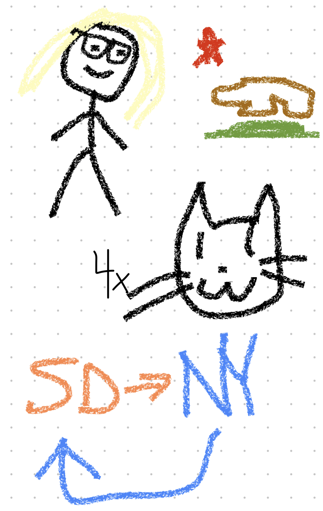

<h1 class="blogtitle"> <b>Monika's Blog :3</b> </h1>

# About Me

My name is Monika, at the time of writing I am 16 years old. I was born in Cali, but left for five years. I spend most of my free time playing video games, talking to friends, and programming.

# Current interests:
 > Destiny 2

 > Linux

 > Politics (dw I try to avoid talking about it)

 > The nim programming language

 > Futurama

 > Valorant (kinda)

 > Geometry Dash

# My pic from day 1
> 
